    ## Loading required package: igraph

    ## 
    ## Attaching package: 'igraph'

    ## The following objects are masked from 'package:stats':
    ## 
    ##     decompose, spectrum

    ## The following object is masked from 'package:base':
    ## 
    ##     union

    ## Loading required package: ggplot2

    ## Loading required package: reshape

    ## Loading required package: lsr

Age related degeneration
========================

### The avg.degree vs age (weeks)

``` r
weeks<- covariates$AGE_WEEKS

degreeForAll<-c(sapply(AdjacencyList,function(x){
  rowSums(as.matrix(x))
}))


df<- data.frame("ROI_Index_L_and_R"= rep(c(1:n),m),
                "Age"= as.factor(rep(weeks,each=n)),
                "Degree" = degreeForAll)

ggplot(data=df,
       aes(x=ROI_Index_L_and_R, y=Degree, colour=Age)) +
  geom_line()
```

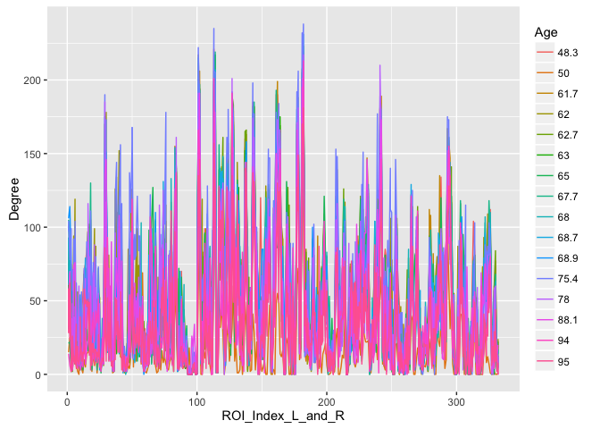

``` r
ggplot(df, aes(x=Degree, fill=Age)) + geom_density(alpha = 0.7, bw = 5)
```

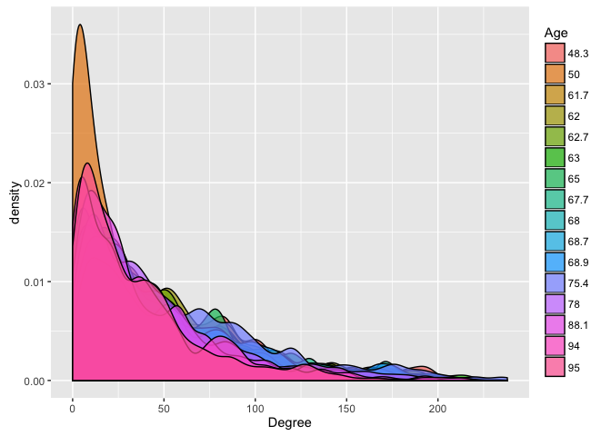

Plot total degree over age:

``` r
sumAForAll<-c(sapply(AdjacencyList,function(x){
  sum(as.matrix(x))
}))

degreeForAll<-(lapply(AdjacencyList,function(x){
  rowSums(as.matrix(x))
}))

nnz<-sapply(degreeForAll, function(x){sum(x>0)})

df<- data.frame("Age"= weeks,
                "AvgDegree" = sumAForAll/n,
                "AvgDegreeNZ" = sumAForAll/nnz,
                "GenoType" = as.factor(covariates$GENOTYPE),
                "Gender" = as.factor(covariates$GENDER)
                )


ggplot(data=df,
       aes(x=Age, y=AvgDegree,col=GenoType)) +
  geom_line()+ggtitle("AvgDegree vs Age")
```

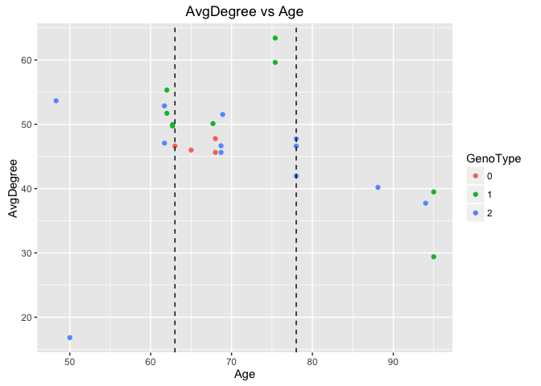

``` r
ggplot(data=df,
       aes(x=Age, y=AvgDegree,col=Gender)) +
  geom_line()+ggtitle("AvgDegrees vs Age")
```

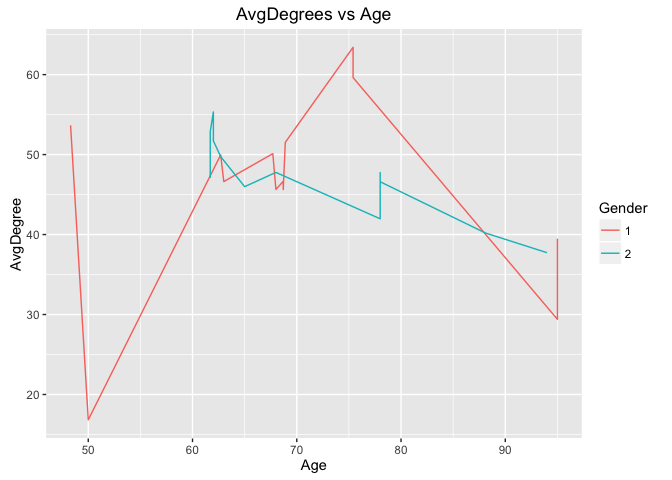

``` r
ggplot(data=df,
       aes(x=Age, y=AvgDegreeNZ,col=GenoType)) +
  geom_line()+ggtitle("AvgDegree (non-zero) vs Age")
```

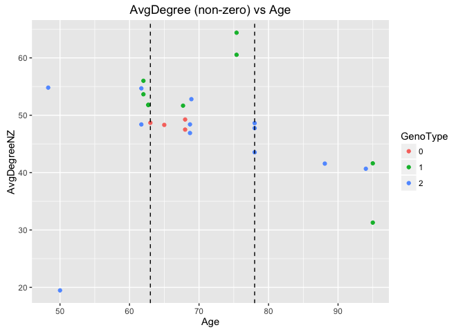

``` r
ggplot(data=df,
       aes(x=Age, y=AvgDegreeNZ,col=Gender)) +
  geom_line()+ggtitle("AvgDegrees (non-zero) vs Age")
```

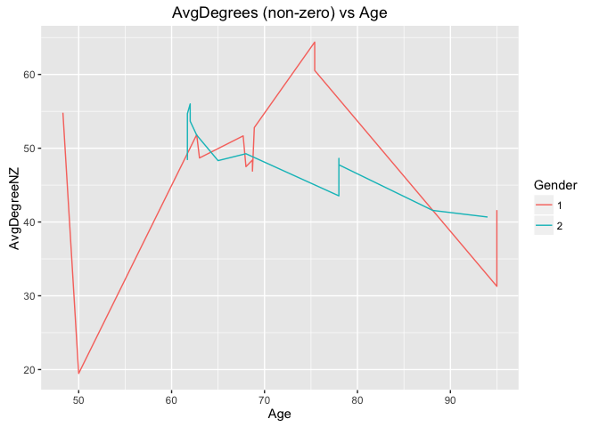

### Divide age into 3 groups

We use 25% (63) and 75% (78) quantiles as cutoffs to divide mice into three group: *young*,*middle* and *old*.

``` r
plot(weeks)
abline(h=63,lty=2)
abline(h=78,lty=2)
```

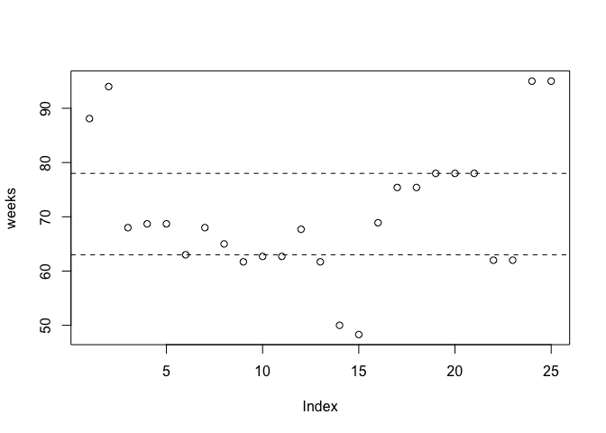

``` r
quantile(weeks,c(0.25,0.75))
```

    ##  25%  75% 
    ## 62.7 78.0

### Comparing Adjacency matrices

Obviously, *old group seems significantly more degenerate than the young and middle*, while the difference beween young and middle is more subtle.

Young (n=):

    ## [1] 9

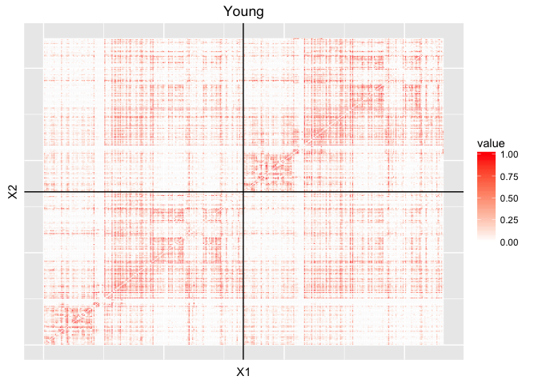

Middle (n=):

    ## [1] 12

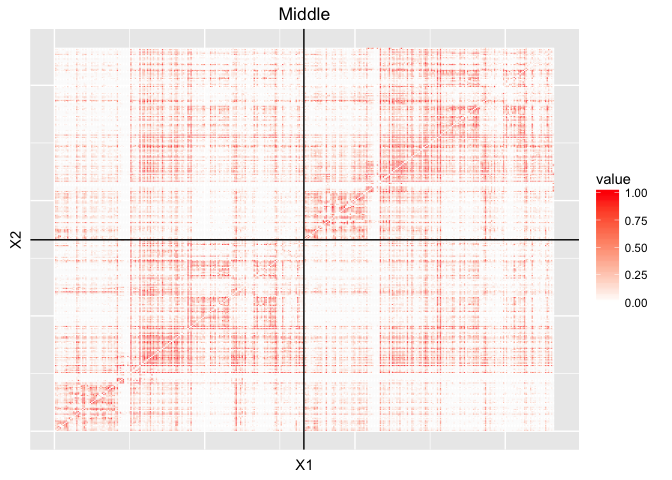

Old (n=):

    ## [1] 4

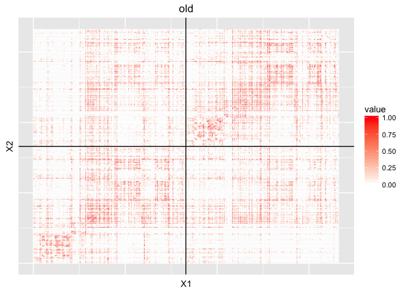

<!-- The dichotomized view with connecting probability>0: it shows the old clearly has less connectivity than the middleage and young. -->
<!-- ```{r,echo=FALSE} -->
<!-- zlim<- 1 -->
<!-- youngAvgWholeBrainDicho<- plotHeatmap((youngAvgA>0)*1,zlimMax = zlim)+ geom_hline(yintercept = n/2 ) + geom_vline(xintercept =  n/2 )+ -->
<!--   ggtitle("Young") -->
<!-- middleageAvgWholeBrainDicho<- plotHeatmap( (middleageAvgA>0)*1,zlimMax = zlim)+ geom_hline(yintercept = n/2 ) + geom_vline(xintercept =  n/2 )+ -->
<!--   ggtitle("Middle") -->
<!-- oldAvgWholeBrainDicho<- plotHeatmap((oldAvgA>0)*1,zlimMax = zlim) + geom_hline(yintercept = n/2 ) + geom_vline(xintercept =  n/2 )+ -->
<!--   ggtitle("old")  -->
<!-- youngAvgWholeBrainDicho -->
<!-- middleageAvgWholeBrainDicho -->
<!-- oldAvgWholeBrainDicho -->
<!-- ``` -->
### Degree distribution of the 3 age groups:

Middle and young mice have higher level of connectivy (degree) than the old.

The degree in the average adjacency:

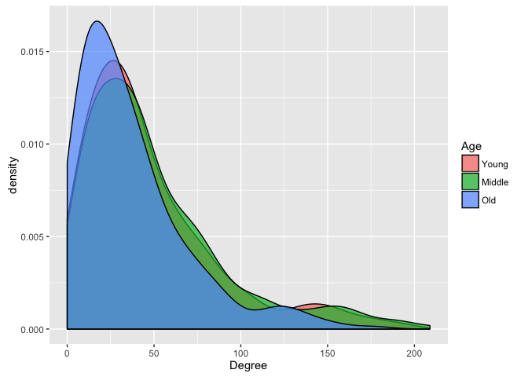

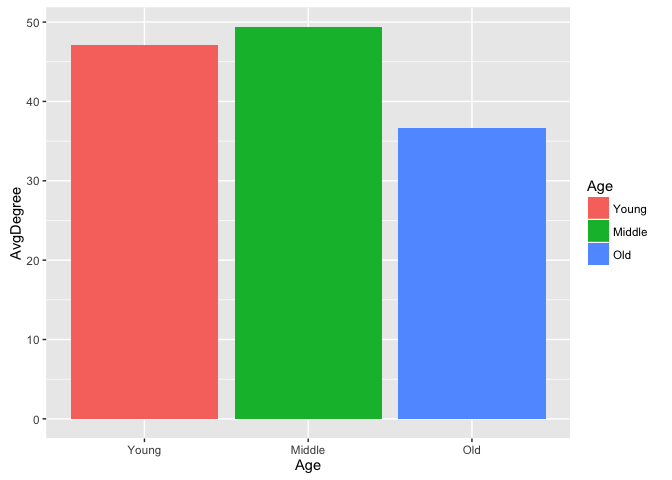

    ## [1] 46.62651 47.08434 49.95181 49.74699 52.87349 16.83133 53.65663 55.33133
    ## [9] 51.71687

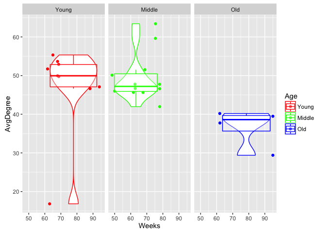

Two sample t-test for middle and old

``` r
t.test(middleageAvgAList,oldAvgAList,"greater", var.equal=T)
```

    ## 
    ##  Two Sample t-test
    ## 
    ## data:  middleageAvgAList and oldAvgAList
    ## t = 3.6909, df = 14, p-value = 0.00121
    ## alternative hypothesis: true difference in means is greater than 0
    ## 95 percent confidence interval:
    ##  6.633716      Inf
    ## sample estimates:
    ## mean of x mean of y 
    ##  49.39056  36.70181

``` r
cohensD(middleageAvgAList,oldAvgAList)
```

    ## [1] 2.13097

<!-- ###Non-zeros distribution of the 3 age groups: -->
<!-- The sum of number of non-zeros in the average adjacency: -->
<!-- ```{r, echo=FALSE} -->
<!-- df<- data.frame("ROI_Index"= rep(c(1:(n)),3), -->
<!--                 "Age"=as.factor(rep(c("Young","Middle","Old"),each=n)), -->
<!--                 "Number_Non_Zero" = c(rowSums(youngAvgA>0), -->
<!--                                       rowSums(middleageAvgA>0), -->
<!--                                       rowSums(oldAvgA>0)) -->
<!-- ) -->
<!-- df$Age<- ordered(df$Age, levels = c("Young","Middle","Old")) -->
<!-- # df<-df[df$Age!="Young",] -->
<!-- ggplot(df, aes(x=Number_Non_Zero, fill=Age)) + geom_density(alpha = 0.7, bw = 10) -->
<!-- ``` -->
<!-- ```{r,echo=FALSE} -->
<!-- ageGroup<-  (weeks<=63)*1 + (weeks>63 & weeks<=78)*2+(weeks>78)*3 -->
<!-- ageGroup[ageGroup==1] = "Young" -->
<!-- ageGroup[ageGroup==2] = "Middle" -->
<!-- ageGroup[ageGroup==3] = "Old" -->
<!-- df<- data.frame( -->
<!--   "Age"= c("Young","Middle","Old"), -->
<!--   "Number_Non_Zero"=c(sum((youngAvgA>0)*1),sum((middleageAvgA>0)*1),sum((oldAvgA>0)*1)) -->
<!--   ) -->
<!-- df$Age<- ordered(df$Age, levels = c("Young","Middle","Old")) -->
<!-- ggplot(data=df, aes(x=Age, y=Number_Non_Zero, fill=Age)) + -->
<!--     geom_bar(stat="identity") -->
<!-- ``` -->
### Genotypes

### Degree distribution of the 3 genotype groups:

Genotype 0 has less connectivity than group 1 and 2:

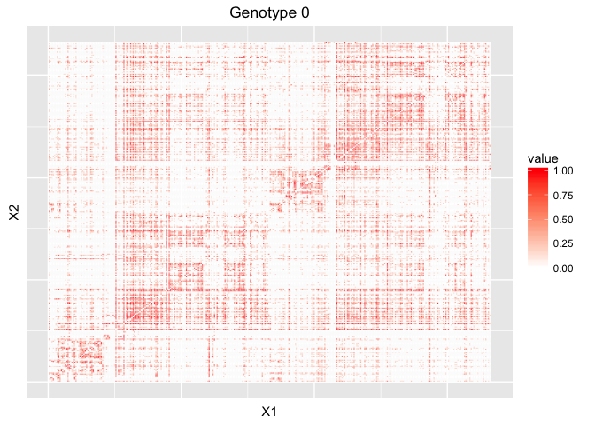

The degree distribution:

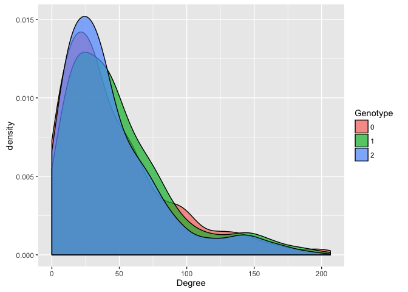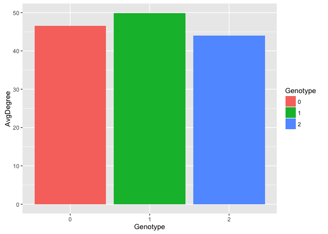

<!-- The non-zeros distribution in the average adjacency: -->
<!-- ```{r,echo=FALSE} -->
<!-- ggplot(df, aes(x=Number_Non_Zero, fill=Genotype)) + geom_density(alpha = 0.7, bw = 10) -->
<!-- df2<- data.frame( -->
<!--   "Genotype"= c("0","1","2"), -->
<!--   "Number_Non_Zero"=c(sum((avgAgene0>0)*1),sum((avgAgene1>0)*1),sum((avgAgene2>0)*1)) -->
<!--   ) -->
<!-- ggplot(data=df2, aes(x=Genotype, y=Number_Non_Zero, fill=Genotype)) + -->
<!--     geom_bar(stat="identity") -->
<!-- ``` -->
### Sex

### Degree distribution of the 2 Sex:

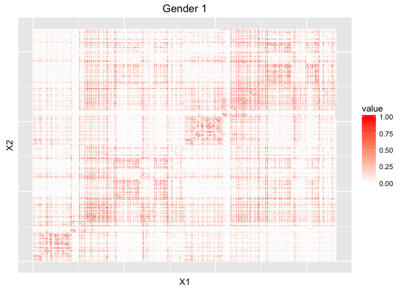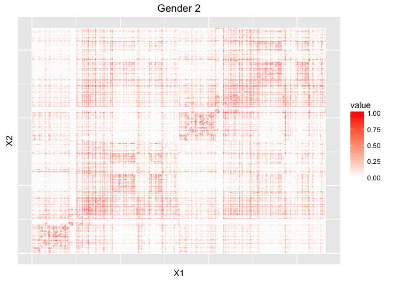

The degree distribution:

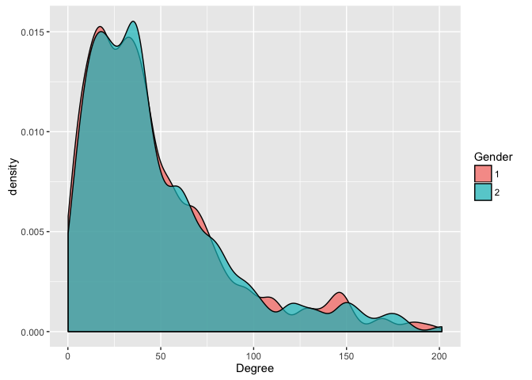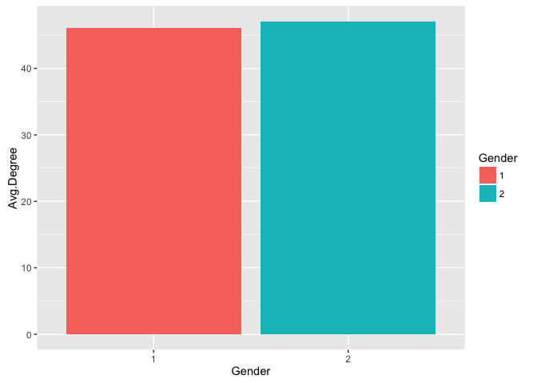

<!-- The non-zeros distribution in the average adjacency: -->
<!-- ```{r,echo=FALSE} -->
<!-- ggplot(df, aes(x=Number_Non_Zero, fill=Gender)) + geom_density(alpha = 0.7, bw = 10) -->
<!-- df2<- data.frame( -->
<!--   "Gender"= c("1","2"), -->
<!--   "Number_Non_Zero"=c(sum((avgAgender1>0)),sum((avgAgender2>0))) -->
<!--   ) -->
<!-- ggplot(data=df2, aes(x=Gender, y=Number_Non_Zero, fill=Gender)) + -->
<!--     geom_bar(stat="identity") -->
<!-- ``` -->
age x genotype
==============

Genotype 0 (only 4 data points in middle age group, skipped)

``` r
sum(covariates$GENOTYPE==0)
```

    ## [1] 4

Genotype 1 ( 9 data points across whole age span)

``` r
sum(covariates$GENOTYPE==1)
```

    ## [1] 9

``` r
pickGene <- covariates$GENOTYPE==1

youngAvgA <- computeAvgA(AdjacencyList[weeks<=63 & pickGene])
middleageAvgA <- computeAvgA(AdjacencyList[weeks>63 & weeks<= 78  & pickGene])
oldAvgA <- computeAvgA(AdjacencyList[weeks>78 & pickGene])

df<- data.frame(
  "Age"= c("Young","Middle","Old"),
  "AvgDegree"=c(sum((youngAvgA)),sum((middleageAvgA)),sum((oldAvgA)))/n
  )

df$Age<- ordered(df$Age, levels = c("Young","Middle","Old"))


ggplot(data=df, aes(x=Age, y=AvgDegree, fill=Age)) +
    geom_bar(stat="identity")
```

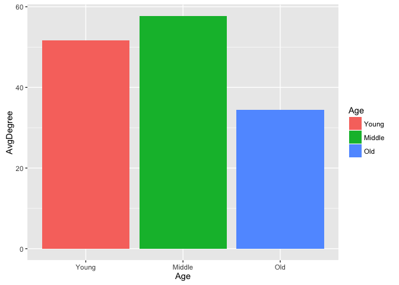

    ## Warning in max(data$density): no non-missing arguments to max; returning -
    ## Inf

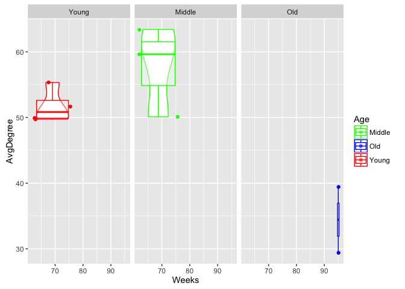

Two sample t-test for middle and old

``` r
t.test(middleageAvgAList,oldAvgAList,"greater", var.equal=T)
```

    ## 
    ##  Two Sample t-test
    ## 
    ## data:  middleageAvgAList and oldAvgAList
    ## t = 3.671, df = 3, p-value = 0.01749
    ## alternative hypothesis: true difference in means is greater than 0
    ## 95 percent confidence interval:
    ##  8.355577      Inf
    ## sample estimates:
    ## mean of x mean of y 
    ##  57.71888  34.43976

``` r
cohensD(middleageAvgAList,oldAvgAList)
```

    ## [1] 3.351144

Genotype 2 ( 12 data points across whole age span)

``` r
sum(covariates$GENOTYPE==2)
```

    ## [1] 12

``` r
pickGene <- covariates$GENOTYPE==2

youngAvgA <- computeAvgA(AdjacencyList[weeks<=63 & pickGene])
middleageAvgA <- computeAvgA(AdjacencyList[weeks>63 & weeks<= 78  & pickGene])
oldAvgA <- computeAvgA(AdjacencyList[weeks>78 & pickGene])

df<- data.frame(
  "Age"= c("Young","Middle","Old"),
  "AvgDegree"=c(sum((youngAvgA)),sum((middleageAvgA)),sum((oldAvgA)))/n
  )

df$Age<- ordered(df$Age, levels = c("Young","Middle","Old"))


ggplot(data=df, aes(x=Age, y=AvgDegree, fill=Age)) +
    geom_bar(stat="identity")
```

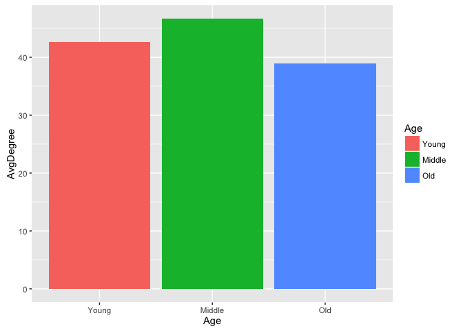

    ## Warning in max(data$density): no non-missing arguments to max; returning -
    ## Inf

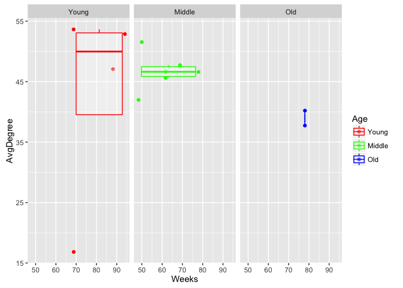

Two sample t-test for middle and old

``` r
t.test(middleageAvgAList,oldAvgAList,"greater", var.equal=T)
```

    ## 
    ##  Two Sample t-test
    ## 
    ## data:  middleageAvgAList and oldAvgAList
    ## t = 3.2456, df = 6, p-value = 0.008781
    ## alternative hypothesis: true difference in means is greater than 0
    ## 95 percent confidence interval:
    ##  3.09994     Inf
    ## sample estimates:
    ## mean of x mean of y 
    ##  46.68876  38.96386

``` r
cohensD(middleageAvgAList,oldAvgAList)
```

    ## [1] 2.65004
